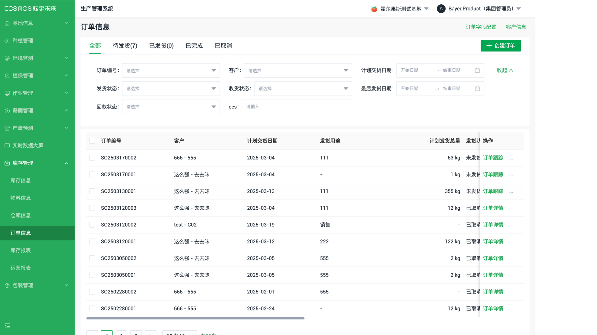
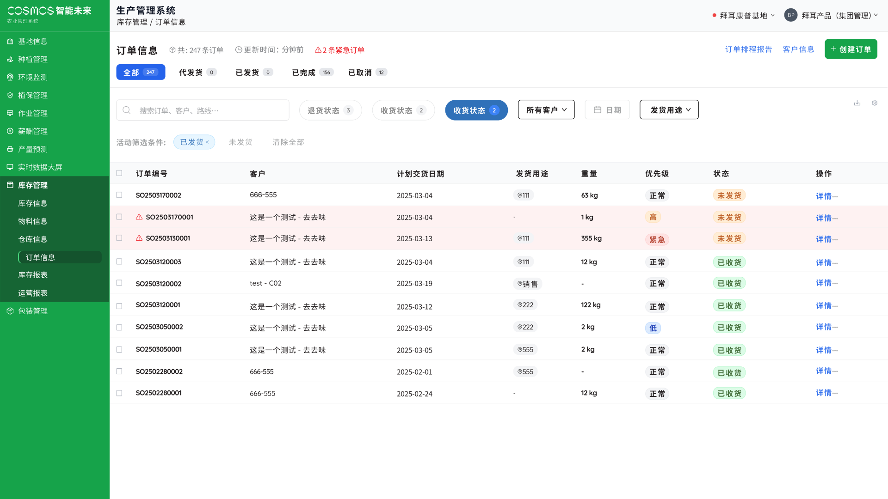

<!-- Centered 16:9 Aspect Ratio Before/After Image Comparison Slider for Markdown, with Green Drag and Hover Color -->

  

    

      
      
      

    

  

**文字优化** 

- 统一字体规范，提升多语言适配性 
- 优化输入框设计，解决文本溢出问题 

**界面优化**

- 采用卡片式布局替代传统表格 
- 解决横向滚动问题 
- 重要信息优先展示，细节按需查看 

**信息展示**

- 核心信息常驻显示（如产品名称、数量） 
- 次要信息（价格、规格、合规信息）可展开查看 
- 保持界面整洁的同时兼顾功能完整性 

**筛选优化** 

- 简单选项（如季节性/非季节性）使用快捷切换按钮 
- 减少点击层级，提升操作效率 

**视觉系统**

- 绿色：完成/正常 
- 红色：紧急/天气警示 
- 橙色：需要关注 
- 蓝色：信息提示 

**智能优先级** 

- 紧急订单置顶显示，红色标识 
- 普通订单标准显示 
- 已完成订单降低显示优先级 

**前端规范化**

- 统一间距、字体标准 
- 统一组件交互行为 
- 确保订单、库存、报表等模块视觉一致性 

**系统反馈标准化** 

- 统一加载状态展示 
- 规范成功/失败提示 
- 统一错误信息样式 

**批量操作** 

- 支持多选编辑 
- 模板创建功能 
- 批量处理常用工作流 

**对比度与格式规范** 

- 提升文字可读性 
- 优化背景层级区分 
- 突出重要信息显示 

**适应各种查看环境** 
 
- 弹窗框架标准化 
- 统一大小与位置规范 
- 固定标题栏 
- 内容区平滑滚动 
- 按钮位置统一 